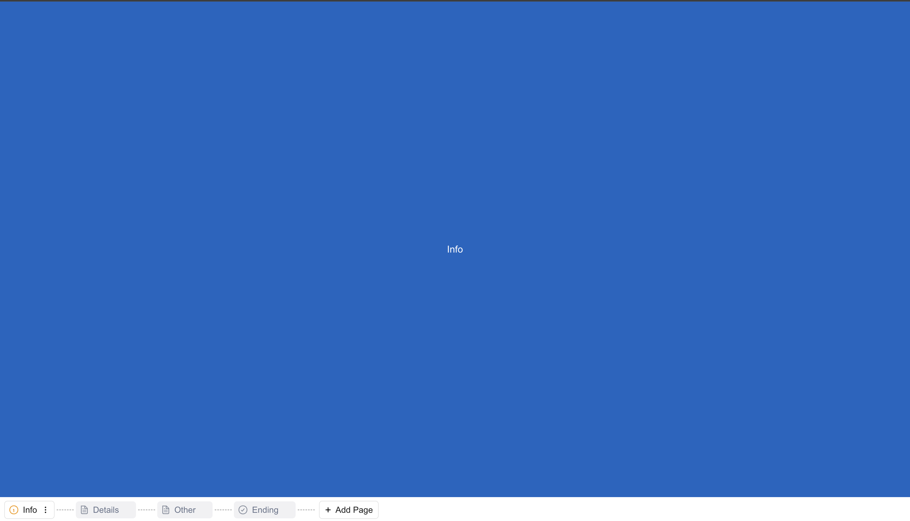
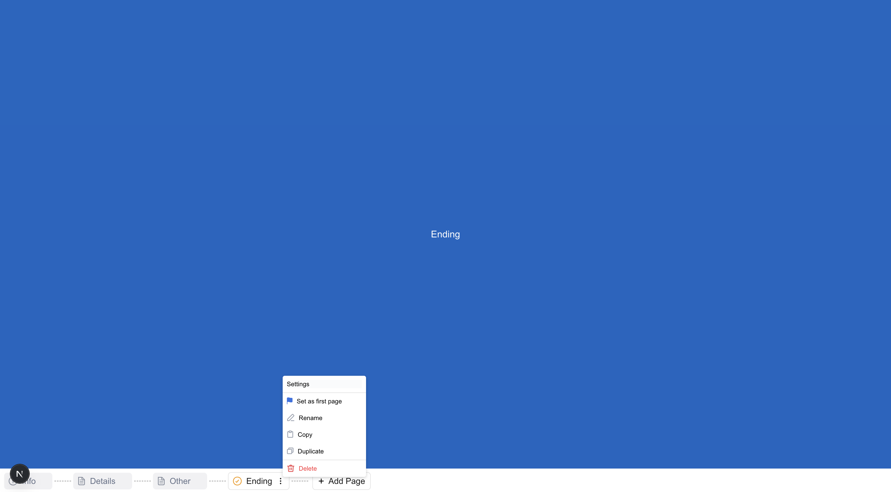

# 📱 Bottom Navigation Bar – Next.js + DnD Kit

This project is a dynamic and interactive **Bottom Navigation** component built with **Next.js**, **React**, and [`@dnd-kit`](https://dndkit.com/). It supports drag-and-drop reordering, hover-based page insertion, and context menus, all while maintaining state entirely in-memory. Designed for a polished, responsive user experience.

---

## ✨ Features

- 🔀 **Drag and Drop**: Reorder navigation items using `@dnd-kit`
- ➕ **Add Page**: Insert new tabs between items via "+" button on hover
- 🖱️ **Context Menu**: Rename, Duplicate, Delete (UI-only)
- ✅ **Active Tab Highlighting**: Click to select and activate tabs
- 🎨 **UI Enhancements**: Smooth transitions and hover effects
- 💾 **In-Memory State**: No backend; uses React state

---

## 🛠️ Tech Stack

- [Next.js](https://nextjs.org/)
- [React](https://react.dev/)
- [@dnd-kit/core](https://dndkit.com/)
- [Tailwind CSS](https://tailwindcss.com/)

---

## 🚀 Getting Started

### Clone the Repository

```bash
git clone https://github.com/poojithamiryala/fillout-frontend-take-home.git
cd fillout-frontend-take-home
````

### Install Dependencies

```bash
npm install
# or
yarn install
```

### Run the Development Server

```bash
npm run dev
# or
yarn dev
```

Visit [http://localhost:3000](http://localhost:3000) to view the app.

---

## 📁 Project Structure

```
/src/app
  ├── bottomNavigation.tsx     # Navigation logic with drag and drop
  ├── page.tsx                 # Main entry point for rendering the nav
  └── shared/
      ├── ContextMenu.tsx      # Shared component for context actions
      └── Modal.tsx            # Shared modal component
```

---

## 📸 Preview






---

## 📦 Deployment

This project is deployed on Vercel:

🔗 [Live Demo – fillout-frontend-take-home.vercel.app](https://fillout-frontend-take-home.vercel.app/)

To build locally:

```bash
npm run build
npm start